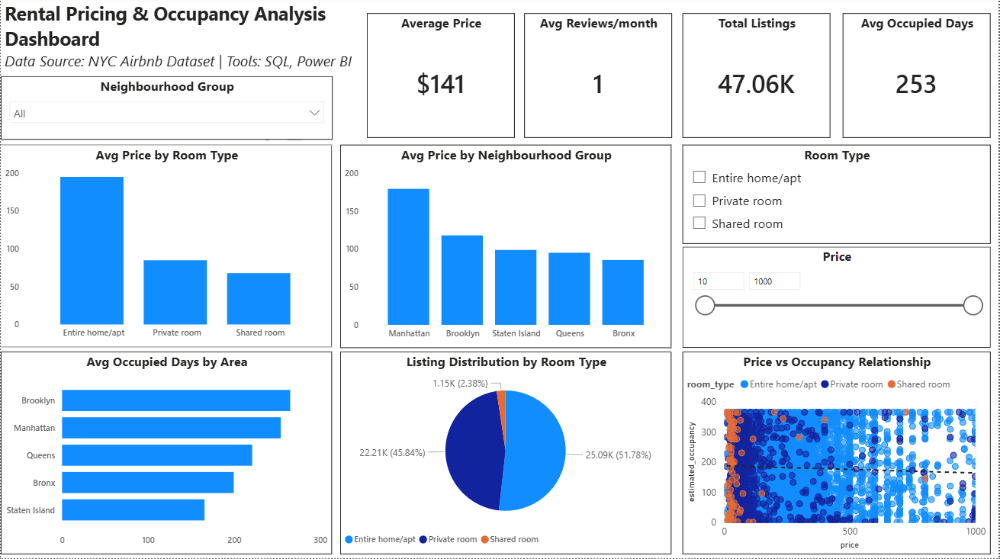

# Rental Pricing & Occupancy Analysis (NYC Airbnb)

## 📊 Project Overview

This project analyzes rental pricing and demand patterns using the NYC Airbnb dataset. The objective was to identify pricing trends, occupancy patterns, and relationships between price and demand using SQL and Power BI.

---

## 🎯 Objectives

* Analyze average pricing across neighbourhood groups and room types
* Evaluate demand patterns using estimated occupancy
* Identify high-demand and high-price segments
* Understand the relationship between price and occupancy

---

## 🛠 Tools Used

* SQL (MySQL) – Data querying and analysis
* Power BI – Data visualization and dashboard creation
* Excel – Data cleaning and preprocessing

---

## 📁 Dataset

* Source: NYC Airbnb Open Data
* Total Records: ~48,000 listings
* Key Columns:

  * price
  * neighbourhood_group
  * room_type
  * availability_365
  * reviews_per_month

---

## 🧹 Data Cleaning

* Removed unnecessary columns (host info, coordinates, etc.)
* Handled missing values in reviews_per_month
* Removed outliers (price > 1000, extreme minimum_nights)
* Created new metric:

  **Estimated Occupancy = 365 - availability_365**

---

## 📈 Key Analysis (SQL)

* Average price across listings
* Price comparison by neighbourhood group
* Price comparison by room type
* Occupancy analysis across locations

---

## 📊 Dashboard Highlights

* KPI metrics:

  * Avg Price: $141
  * Total Listings: 47K+
  * Avg Occupied Days: 253
* Manhattan has the highest average pricing
* Brooklyn shows higher occupancy trends (strong demand)
* Entire home/apartment listings are priced significantly higher
* Scatter plot indicates moderate price sensitivity in demand

---

## 📷 Dashboard Preview

---

## 💡 Key Insights

* Pricing varies significantly across neighbourhood groups
* Demand (occupancy) does not always correlate directly with price
* Mid-priced listings often show stable occupancy
* Location plays a critical role in both pricing and demand

---

## 🚀 Conclusion

This project demonstrates the ability to clean, analyze, and visualize real-world data to extract meaningful business insights related to pricing strategy and demand patterns.

---

## 👤 Author

**Anubha Rathi**
